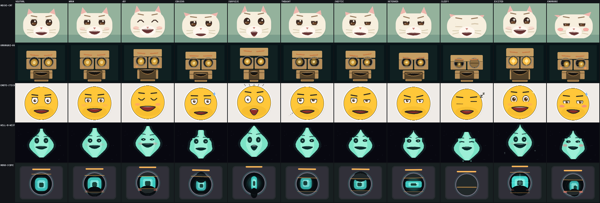
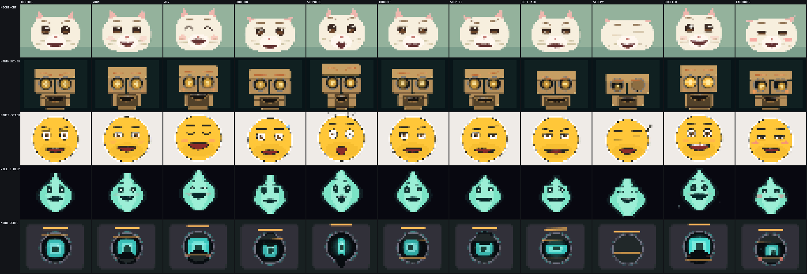

# fable_expression_actors_v3 — five distinct actors for the 40-byte IR

Five **structurally different** character renderers for the 160×120
RGB565 StackChan face, each a pure function of the full 40-byte
`face_render_key_t` (schema v2) plus the 16 kHz sample clock. Integer
only, heap free, stateless, byte-identical across O0/O2, host and WASM.

Where earlier packs shared one rig across palette-swapped skins, these
five have different silhouettes, feature mechanics, and signature
acting channels — no generic black ovals:



The same sheet at the exact 40x30 matrix density (nearest-neighbour,
shown 4x):



| # | slug | structure | signature emotion channel |
|---|------|-----------|---------------------------|
| 0 | `fea-mochi-cat` | plush cat mascot | articulated ears (perk/droop/flatten/asym), whisker droop, bead eyes under fur lids, embarrassed head-turn |
| 1 | `fea-karakuri-brass` | segmented plate puppet | shutter-iris eyes with lower-leaf squints, sliding visor/brow slats, integrated hinged jaw cavity, cheek lamps |
| 2 | `fea-emote-sticker` | outlined badge face | emoji grammar: arc joy-eyes, sweat drop, sparkles, Zzz, shock rays, thought dots |
| 3 | `fea-will-o-wisp` | emissive night spirit | silhouette morphs around a fixed face: flame crown, surprise flare, sleepy sag + drips; asymmetric brow/lid speech peaks |
| 4 | `fea-mono-scope` | **eye-only** cyclops | one bright Vector-style eye-light IS the face: shutter lids, smile-cut lower edge parented to the mouth-corner IR, wide pupil saccades; speech lives in the light (no mouth panel) |

## What is here

```
src/fea.h              public API (profiles, info, probe, render)
src/fea_internal.h     fixed-point conventions, pose, draw API
src/fea_math.c         hash, isqrt, sine LUT, acting curve, blink wave
src/fea_solve.c        one shared performance solver for all actors
src/fea_draw.c         integer scanline/bbox compositor (AA, Q4)
src/fea_actor_*.c      the five actors (layout + raster + probe each)
src/fea_registry.c     profile table and entry points
compat/                verbatim firmware ABI copies (see compat/README.md)
tests/test_fea.c       20,754-check suite (see below)
tests/golden_hashes.inc frozen FNV-1a32 frame hashes (85 cases)
bench/bench_fea.c      -O3 timing
tools/fea_dump.c       hash/sheet/cell dumper (labeled sheets)
preview/               original-size contact sheets (PPM + PNG)
DESIGN.md              architecture notes
INTEGRATION.md         exact production mapping suggestions
manifest.json          machine-readable summary
```

## Quick start

```sh
make test          # strict native suite
make asan          # same suite under ASan+UBSan, no recover
make strict        # O0 vs O2 frame hashes byte-identical
make bench         # us/frame per profile at -O3
make sheets        # labeled contact sheets into preview/
make wasm-verify   # emcc build; hash tables must match native
make xtensa-check  # ESP32-S3 cross compile + float-symbol scan
```

ABI headers default to `compat/`; `ABI_INC=../../../../firmware-ws/main
make test` builds against the live tree.

## How the 40 bytes are consumed

One shared solver (`fea_solve.c`) resolves the whole IR before any
actor draws; the actors differ in how the pose becomes pixels:

- **Controls prefix (bytes 0–11)** — baseline mouth (open/width/round/
  press/teeth), per-eye apertures, gaze target, brow baseline, the
  activity axis (idle/listening/thinking/speaking blink + gaze
  schedules), and SPEAKING/BLINKING flags.
- **Articulation (12–19)** — OVR15 viseme rows for all fifteen shapes,
  coarticulated with `viseme_secondary` by `viseme_blend`, weighted by
  `viseme_weight`, JALI-style jaw/lip split; `viseme_set` selects
  OVR15 natively or collapses VRM5 / Preston-Blair-9 / Microsoft-22
  through mapping tables; `phoneme` adds a deterministic sub-viseme
  micro-shape; `audio_level` drives the speech head-bob and brow
  beats; `speech_phase` poses anticipation (STARTING: lids/brows up,
  lips pre-pressed, inhale stretch) and settle (ENDING: relax, soft
  settle smile).
- **Facial actions (20–31)** — mouth corners are **parents**: the two
  lip-curve endpoints every other mouth feature derives from; tongue,
  cheek (blush pads / indicator lamps / lens arcs per actor), per-eye
  squints, brow inner/outer with a FACS-correct oblique-vs-lowered
  distinction, head roll shear, affect valence (corner bias) and
  arousal (breath rate, pupil, motion energy).
- **Performance (32–39)** — head yaw/pitch and body lean feed one
  whole-face transform with area-conserving squash & stretch;
  `attention` scales gaze wander (Anki-style focus) and the scope's
  halo ring; `schema_version` gates the extended bytes (v0/v1 keys
  degrade to the 12-byte prefix); `stage_expression` ×
  `expression_weight` drive the acting curve.
- **Anticipation–active–settle** — `expression_weight` maps through a
  non-monotonic LUT (dip −7 % → rise → +8 % overshoot → exact settle),
  so a stage cue's attack ramp acts in time with zero renderer state.
  Verified by test: dip < −8/256 in the first 19 % of the ramp, peak
  > 262/256, settle == 256/256.
- **Deterministic life** — blinks with measured human kinematics
  (94 ms ease-in close, 50 ms hold, 244 ms cubic reopen, ~14 %
  doubles, activity-scaled rates ~17–26/min), Eyes-Alive saccades
  (exponential magnitudes, 8-way direction table, main-sequence
  durations, thinking-aversion up-bias), two-sine fixation drift, and
  asymmetric breathing (inhale 42 %, arousal-scaled, held during
  surprise). All schedules hash the sample clock: any frame, any
  order, bit-identical.

## v4 revision notes

Applied after manual review of native, exact-40x30, and 16-frame
sheets (plus an external advisory pass):

- **mono-scope is now eye-only.** The floating LED mouth panel is
  gone; speech carries through the eye-light (jaw stretches it,
  width/round/press reshape it, teeth adds a bright scanline, tongue a
  warm under-core, audio pulses the aperture) and the light's lower
  edge is parented to the mouth-corner/curve channels — joy/warm read
  as the Anki happy-eye arch. Pupil saccade travel widened; every
  mouth IR byte remains provably live.
- **will-o-wisp anchors are fixed in face space.** Eye baseline,
  inter-eye distance and mouth anchor no longer move with silhouette
  morphs; a face-band minimum keeps glow mass under the features
  (sleepy included); eyes never thin below ~2.5 px and closed eyes
  are thick double seams; speech adds deterministic asymmetric
  brow/lid/spark peaks.
- **karakuri jaw is integrated.** Seam lines tie the cavity to the
  chin-plate edges, a hinged lower-jaw plate rides the cavity floor,
  the cavity is wider with a larger gape range, the chin plate itself
  hinges, and the lower shutter leaf now rises with the lower-lid
  channel so warm/joy squints read mechanically. Sensor pupils got
  visibly larger gaze travel.
- **mochi-cat** lost its facial noise (two solid whiskers, no
  philtrum), gained thick chevron closed lids, an embarrassed
  head-turn with strongly asymmetric ear fold, and no longer has the
  one-pixel breath chin bob (breathing now lives in scale/aperture
  only, for every actor).
- **emote-sticker** untouched except the shared acting curve now
  settles deeper (overshoot -> undershoot -> exact rest).
- **Rasterizer bug fixed:** stroke AA bands and glow halos computed a
  0/1 fraction instead of Q8 — thin strokes were invisible and halos
  were hard-edged. Found by the byte-liveness gate when the scope's
  teeth scanline vanished; every actor's edges are cleaner now.
- Latent clip risk fixed: mouth lower-bezier bounds are now hard-capped
  and included in the probe extents, so the no-clip proof covers the
  jaw at any IR extreme.

## Results (v4, 2026-07-29, Apple clang arm64 host)

**Correctness / determinism**

- `make test`: **20,142 checks, 0 failures** — ABI, purity, guard
  bands, full pixel coverage, repeat determinism, emotion
  separability, temporal smoothness, blink kinematics, corner
  parenting, acting curve, viseme articulation + vocabulary sets,
  **all-40-bytes-live proof per profile**, adversarial fuzz (1,500
  random keys + structured extremes, probe-verified geometry bounds),
  85 golden hashes.
- `make asan` (ASan + UBSan, `-fno-sanitize-recover=all`): same suite,
  0 failures, no reports.
- `make strict`: O0 and O2 frame hashes byte-identical.
- `make wasm-verify` (emscripten -O2, node): all case hashes identical
  to native; full suite passes in wasm.
- `make xtensa-check` (xtensa-esp32s3-elf-gcc 14.2.0): compiles clean
  with `-Wall -Wextra -Werror`; no float helper symbols.

**Acting quality** (harness mirrors
`firmware-ws/tests/face_render_quality.c`: same base key, cues through
the real `face_stage_cue_apply`, same ROI and thresholds; gates:
distinct == 11, clear == 10, weak pairs == 0, mean pair ≥ 0.010, zero
jumps, max Δ < 0.14, frozen < 30)

| profile | distinct | clear | weak pairs | mean pair ROI Δ | jumps | max Δ | frozen |
|---|---|---|---|---|---|---|---|
| mochi-cat | 11/11 | 10/10 | 0/55 | 0.0687 | 0 | 0.0327 | 0 |
| karakuri-brass | 11/11 | 10/10 | 0/55 | 0.0876 | 0 | 0.0394 | 0 |
| emote-sticker | 11/11 | 10/10 | 0/55 | 0.0719 | 0 | 0.0451 | 0 |
| will-o-wisp | 11/11 | 10/10 | 0/55 | 0.0775 | 0 | 0.0271 | 0 |
| mono-scope | 11/11 | 10/10 | 0/55 | 0.0758 | 0 | 0.0522 | 0 |

Mean pair separation is 6.9–8.8× the 0.010 gate; temporal peaks sit
2.7–5× under the 0.14 ceiling. The mono-scope rework raised its
separation from 0.0565 (v3) to 0.0758 while removing a whole feature
panel.

**Speed** (`make bench`, -O3, 600 frames, all-emotion/viseme rotation)

| profile | us/frame (host) | 100×-derated ESP32-S3 | 30 fps budget share |
|---|---|---|---|
| mochi-cat | 17.8 | 1.78 ms | 5 % |
| karakuri-brass | 22.8 | 2.28 ms | 7 % |
| emote-sticker | 26.9 | 2.69 ms | 8 % |
| will-o-wisp | 10.0 | 1.00 ms | 3 % |
| mono-scope | 32.8 | 3.28 ms | 10 % |

Even under the pack convention's deliberately pessimistic 100×
host→device derating, the slowest actor leaves ~10× headroom against
the 33.3 ms 30 fps budget. Measure under `esp_timer` before shipping
device fps claims.

**Code size** (xtensa -O2): `text 26,615 B, data 0, bss 0` across all
nine objects. No context struct (`FEA_CONTEXT_BYTES == 0`), stack-only
scratch, caller-owned framebuffer (38,400 B).

**No clipping**: the geometry probe (the same layout code the
rasterizer uses) exposes feature extents; tests assert every extent,
pupil, and mouth corner stays on-frame across the 11-emotion sweep,
1,500 random keys, and all-0x00/0xff/0x80/0x7f extremes. Ear tips,
sleepy drips, and drop shadows carry explicit safe-area clamps.

## Reviewed contact sheets (v4)

- `expression-actors-v4__11-emotions__native.png` — 5 × 11 at device
  scale.
- `expression-actors-v4__11-emotions__40x30-nn.png` — the same cells
  as **exact 40x30 nearest-neighbour** pixels (matrix density);
  `...__40x30-nn__x4.png` shows the identical pixels 4x for review.
- `expression-actors-v4__15-visemes__native.png` and
  `...__40x30-nn__x4.png` — all OVR15 shapes.
- `expression-actors-v4__temporal__<actor>__16f__native.png` and
  `...__40x30-nn__x4.png` — sixteen consecutive 30 fps frames; the
  strip cue uses a LINEAR 12-frame attack so ~2 frames of anticipation
  dip land in F02–F04 and the overshoot settle in F12–F14, labeled per
  frame.

Every cell of the 40x30 sheets was inspected by eye; the v4 changes
above came from that review, not from the metrics.

## Provenance

All code in this directory was written for this contribution. Behavior
targets come from published research and open documentation:
VanderWerf 2003 lid kinematics, Bentivoglio 1997 blink rates, Lee/
Badler/Badler 2002 saccade statistics, Anki Cozmo/Vector *technique*
notes from the official DDL repository (per-corner eye geometry,
focus-scaled darts — no code or assets), JALI's jaw/lip split, FACS AU
prototypes, Keltner 1995 embarrassment display, and emoji design
grammar. GPL projects informed ideas only; no code, structure, or art
was taken from them. The compat/ ABI copies are first-party project
files.

## Known limits / future work

- The mono-scope's sleepy pose closes the lens almost fully; a
  half-mast variant would read "drowsy" rather than "asleep" if the
  primary agent prefers.
- Gesture kinematics are bounded by the stage layer's triangle wave;
  per-cycle decay would need a stage-side change.
- Wisp star field is static by design; a slow twinkle would need a
  temporal-delta re-review.
- Device `esp_timer` numbers not yet measured (toolchain compile is
  proven, timing is not).
