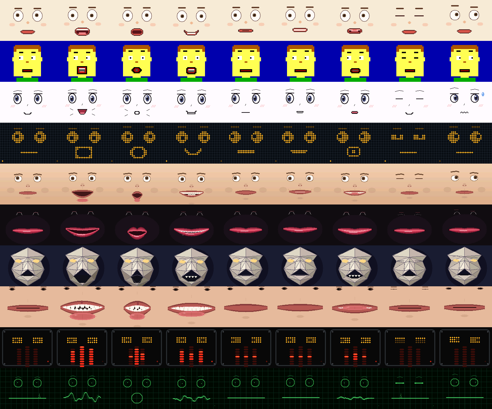

# fable_mouth_geometry — mouth & viseme-geometry renderer pack

Ten visibly different mouth-centric face renderers for the 160x120 RGB565
face lab, driven only by the stable 12-byte semantic keyframe plus the
16 kHz sample clock. Everything is portable C11, integer-only, allocation-
free, and a **pure function of (keyframe, clock)** — the WebAssembly build
produces byte-identical frames (proven by a shared golden CRC table).



Rows top to bottom: Preston Blair sprites, EGA talkie flap, manga snap,
flip-dot matrix, JALI jaw-lip polygon, bezier ribbon lips, origami mask,
teeth & tongue closeup, LED VU mouth, oscilloscope trace. Columns: idle,
AA, OH, EE, MBP, FV, LN, blink, thinking.

## Layout

```
src/fmg.h            public API (keyframe ABI, profiles, render, coart)
src/fmg_internal.h   shared internals
src/fmg_common.c     fixed-point math, idle motion, mouth model, rasterizer
src/fmg_coart.c      optional coarticulation stage (caller-owned state)
src/fmg.c            profile registry / dispatch
src/fmg_r_*.c        one file per renderer
test/test_fmg.c      3456-check suite incl. golden CRCs (test/golden_crc.inc)
test/bench_fmg.c     host benchmark
tools/build.sh       build + check_sprites + tests + bench [golden|preview|wasm]
tools/check_sprites.py  validates the 37 hand-authored ASCII cel arrays
tools/render_preview.c  montage / animation-strip dumper (PPM)
manifest.json        machine-readable renderer manifest
RESEARCH.md          source & licensing research report
```

## Build & test

```
tools/build.sh            # sprite check, full test suite, benchmark
tools/build.sh preview    # + preview/montage.ppm/.png and anim strips
tools/build.sh wasm       # + emcc build; same golden table must pass in node
tools/build.sh golden     # regenerate golden CRCs after intentional changes
```

## Design notes

- **Semantic keyframe in, pixels out.** `fmg_keyframe_t` is byte-compatible
  with the host `face_keyframe_t`; `fmg_info_t` matches the host's 16-byte
  renderer-info ABI (`family` = MOUTH). Six renderers slot directly onto
  existing `face_render_profile_t` mouth entries (see manifest.json); four
  are new-profile candidates.
- **Discrete viseme classifier.** Sprite systems need a cel index, so
  `fmg_mouth_compute` nearest-anchor-classifies the five mouth bytes against
  the same shape table the host viseme tracker flattens through
  (`face_viseme.c s_shapes`), i.e. it inverts the host's own mapping into
  ten Preston Blair/Rhubarb-style classes.
- **JALI axes for polygon systems.** `jaw_q8` is openness gated by bilabial
  press (a closure must win over a vowel — the JALI paper's key anatomical
  point) and `lip_q8` is articulation intensity; polygon mouths consume the
  axes instead of raw bytes.
- **Deterministic idle motion** (`fmg_idle_compute`) is scheduled purely
  from the sample clock via an integer hash: blinks with anticipation
  pre-widen, fast close, slow reopen and follow-through overshoot,
  occasional double blinks; ballistic 40 ms saccades between hashed
  fixations with micro-drift, damped while speaking or under strong
  commanded gaze; brow waves plus occasional (sometimes asymmetric) raises,
  listening/thinking activity poses; breathing bob and slow sway.
- **Coarticulation is a separate, optional stage.** Pure renderers cannot
  smooth across frames by definition, so `fmg_coart_t` (caller-owned, still
  deterministic) applies Cohen-Massaro-flavored dominance blending with
  per-articulator time constants: heavy jaw, medium corners, fast plosive
  press. Feed raw keyframes through it before rendering for inbetweens; skip
  it when the host stream is already smoothed.
- **No floats anywhere** — not even in tests — so cross-platform byte
  identity is structural, not aspirational. Sine is an integer Bhaskara I
  approximation; ellipses use integer square roots; beziers are Q4
  fixed-point evaluated per column or scanline.
- **Right shifts of negative values** (arithmetic shift) are relied on, as
  everywhere else in this repo's firmware; clang, gcc, and emscripten all
  guarantee it.

## Performance

Host benchmark (Apple Silicon, -O2): 1.7-33.4 us/frame; the only outlier is
the flip-dot board (768 disc fills). Even at a conservative 100x derate for
a 240 MHz ESP32-S3 that is ~3.3 ms worst case against the 33 ms 30 fps
budget. Estimated ops/pixel per profile are in the manifest/`fmg_info_t`.

## Integration sketch

The pack is self-contained. To wire a profile into the host renderer:
include `src/fmg.h` (or lift the `fmg_r_*.c` body plus the shared chassis
into the firmware's renderer table), map `face_keyframe_t` bytes 1:1, and
forward the playout sample clock. `contrib/fable_mouth_geometry` files
depend only on `<stdint.h>`/`<stdbool.h>`/`<stddef.h>`.
