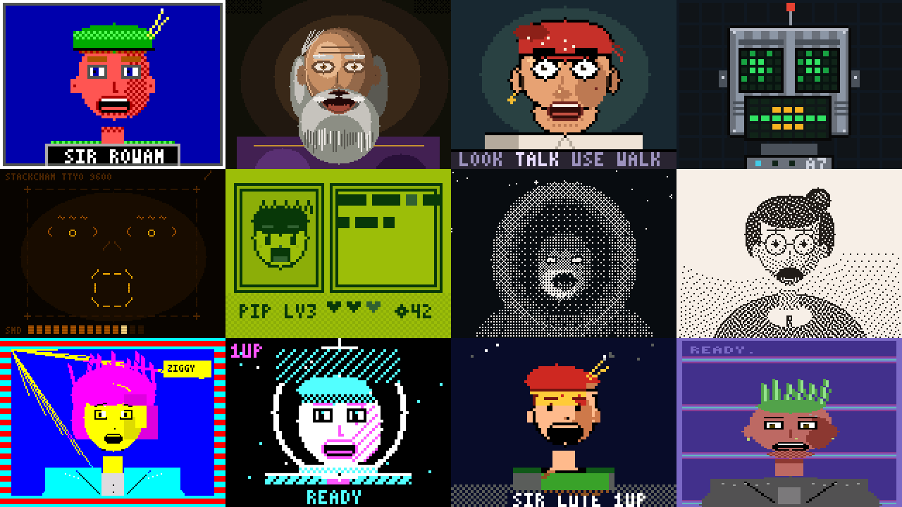

# fable_pixel_character — pixel & adventure-game talking portraits

Twelve original, genuinely distinct pixel-art talking-portrait renderers
for the StackChan face contract: one 160×120 RGB565 frame per call, pure
integer arithmetic, no allocation, no retained state, byte-identical
between native and WebAssembly builds.



## The renderers

| # | Slug | System that makes it distinct |
|---|------|-------------------------------|
| 1 | `ega_quest` | Sierra-style 16-colour EGA hero box; checkerboard pairs fake the midtones EGA lacked; sprite mouth bank; name plate |
| 2 | `vga_elder` | 256-colour-era closeup; banded ramps from nested offset ellipses; continuous polygon lips inside a full beard; flickering candle rim light |
| 3 | `talkie_closeup` | Talkie-era flat fills + bold outlines; the jaw block physically drops with `mouth_open`; verb bar; asymmetric acting brows |
| 4 | `pixel_automaton` | 5×5 LED-matrix eyes (pupil block tracks gaze, rows collapse on blink); seven-column VU-segment mouth with speech shimmer |
| 5 | `amber_terminal` | Face built from character cells with a 5×7 phosphor font; glyph-string mouth shapes; scanline dimming; audio meter |
| 6 | `pocket_rpg` | Four-shade handheld dialogue scene; three-frame flap mouth; mock text types on while speaking; blinking continue arrow |
| 7 | `dithered_rogue` | Grayscale-composed hooded figure quantised by ordered Bayer 8×8; torch flicker + film grain keep the dither alive |
| 8 | `atkinson_portrait` | Same grayscale pipeline quantised by Atkinson error diffusion (6/8 of error) on paper white; drifting window light |
| 9 | `zx_attribute` | Free drawing forced through 8×8 ink/paper cells with a shared bright bit — authentic attribute clash; animated tape-loading border |
| 10 | `cga_arcade` | Black/cyan/magenta/white only; all shading is diagonal cross-hatch; starfield + INSERT COIN attract mode |
| 11 | `nes_tile` | Free drawing forced through four fixed 3-colour subpalettes per 16×16 block — period-correct attribute-edge errors |
| 12 | `c64_multicolor` | Double-wide (2×1) multicolor pixels, breadbin palette, drifting raster bars, READY. prompt with blinking cursor |

The first seven slugs correspond one-to-one to the reserved
`FACE_RENDER_FAMILY_PIXEL` slots in `firmware-ws/main/face_render.h`
(`FACE_RENDER_EGA_QUEST` … `FACE_RENDER_DITHERED_ROGUE`); the last five are
extra profiles for new enum entries if wanted. Full metadata (characters,
palettes, dither strategies, idle behaviours, measured host cost) lives in
[`manifest.json`](manifest.json).

## Shared systems

- **Deterministic idle rig** (`src/pf_idle.c`): blinks (with occasional
  double blinks), micro-saccades with centre bias, brow acts, breathing,
  speech head-bob, and a smooth flicker channel — all O(1) functions of the
  16 kHz sample clock hashed with a per-profile salt, so any frame can be
  reproduced from `(profile, keyframe, clock)` alone.
- **Mouth systems** (four genuinely different ones): a ten-shape sprite
  bank shared through role-based colour maps (`src/pf_mouthbank.h`), a
  continuous scanline polygon mouth with teeth/tongue (`src/pf_mouth.c`),
  LED/VU segments, glyph strings, and a quantised three-frame flap.
- **In-place art surface** (`src/pf_engine.c`): scenes are composed in an
  8-bit index/grayscale surface that aliases the caller's RGB565 buffer,
  then expanded back-to-front through a palette — zero extra buffers. The
  aliasing is safe because the source byte offset never exceeds the
  destination byte offset (proof in the comment at the top of
  `pf_engine.c`).
- **Post-pass constraint emulators**: the ZX ink/paper resolve and the NES
  subpalette-block remap run over the finished art, so the hardware
  artefacts (clash, attribute edges) appear exactly where a real machine
  would produce them.

## Layout

```
src/        renderers + engine (portable C11, the deliverable)
compat/     verbatim copies of the firmware ABI headers
tests/      test suite + golden CRC table
tools/      review-image generator (PNG), host benchmark
out/        generated pose/idle sheets per profile + overview
```

## Build & test (host)

```
make test          # ABI, error paths, metadata, determinism, bounds,
                   # full coverage, keyframe reactivity, idle motion,
                   # golden CRCs (12 profiles x 8 poses)
make frames        # regenerate out/*.png review sheets
make bench         # ms/frame per profile on the host
make verify-wasm   # emcc + node: byte-identical WASM check
make golden        # regenerate tests/golden_crcs.inc after art changes
```

`ABI_INC=../../../../firmware-ws/main make test` compiles against the live
firmware headers instead of the vendored copies.

Measured on an Apple-silicon laptop the most expensive profile
(`atkinson_portrait`, serial error diffusion) is 0.112 ms/frame; scaled by
a generous 50× for an ESP32-S3 that is ~5.6 ms — comfortably inside a
33 ms/30 fps budget. `estimated_ops_per_pixel` in the manifest ranks the
profiles for on-device verification.

## Keyframe interpretation

All five mouth channels are honoured: `mouth_open` drives opening,
`mouth_width` widens/narrows, `mouth_round` rounds (OO/OH shapes),
`mouth_press` presses lips (MBP) and suppresses opening, `mouth_teeth`
reveals teeth (SS/FV/EE). `eye_left_open`/`eye_right_open` are composed
multiplicatively with the blink envelope; `look_x/look_y` bias gaze under
the micro-saccades; `brow` adds to the idle brow acts;
`FACE_KEYFRAME_FLAG_SPEAKING` gates head-bob, VU shimmer, and typing
effects; `FACE_KEYFRAME_FLAG_BLINKING` forces lids closed. The
`expression` byte is currently ignored (its semantics are not defined by
the contract); wiring it to per-profile moods is a clean follow-up.

## Licensing

See [RESEARCH.md](RESEARCH.md): all code and art are original; techniques
come from hardware facts and public-domain algorithms; the one GPL project
reviewed (RoboEyes) was explicitly not used.
