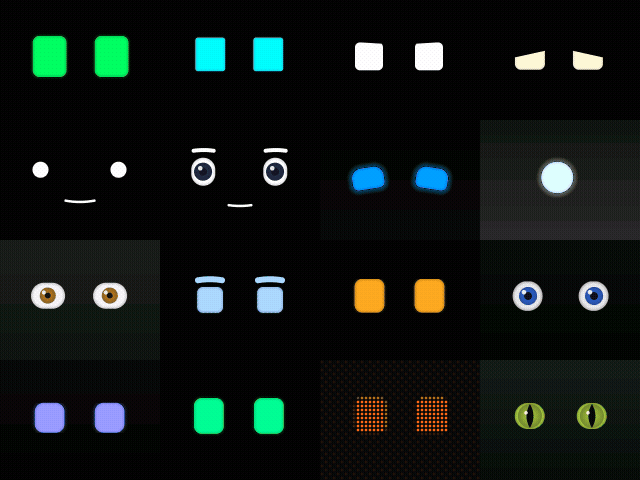

# fable_robot_eyes

Standalone procedural robot-face renderer pack: **16 eye-forward
profiles** (8 complete robot faces, 8 single-behavior eye studies) on a
shared stateless behavior engine, written for the brief in `BRIEF.md`.



## What is here

| File | Role |
|---|---|
| `fable_robot_eyes.h` | Public API: 12-byte keyframe (layout-identical to `face_keyframe_t`), profile enum, 16-byte info struct, `fre_render_frame`, `fre_behavior_solve` |
| `fre_internal.h` | Fixed-point conventions, hashing, easing, style/tuning tables |
| `fre_behavior.c` | Stateless behavior solver: blinks, saccades, microsaccades, refixations, social gaze, brows, acts, breathing, drowsiness, pupil |
| `fre_draw.c` | Integer rasterizer: rounded-rect eyes with per-corner radii, rotation, lid cut lines, iris/pupil/slit/highlight, quadratic capsules, glow, analytic AA |
| `fre_profiles.c` | The 16 profile definitions and frame composition |
| `tests/test_fable_robot_eyes.c` | 30k+ checks: ABI, canaries, determinism, blink kinematics, saccade structure, social gaze, lid anticipation, drowsiness, golden hashes |
| `tools/fre_dump.c` | Contact sheets, animation dumps, strips, frame hashing, benchmarks |
| `manifest.json` | Renderer manifest: profile slugs mapped to `face_render_profile_t` suggestions, ABI notes, perf numbers |
| `RESEARCH.md` | Source/licensing audit and the literature-to-constant mapping |
| `preview/` | GIFs rendered by this code (idle grid, speaking grid, doze timelapse) |

## Contract compliance

- 160×120 RGB565 into a caller-owned buffer; capacity checked.
- Pure function of `(profile, keyframe, sample_clock)`: no allocation,
  no retained state, no floats, no implementation-defined shifts.
- **Byte-identical WebAssembly verified**: an `emcc -O2` build of the
  core produced hash-for-hash identical frames to the native arm64
  build (`make strict` also proves `-O0` ≡ `-O2`).
- Host benchmark 10–45 µs/frame per profile (dot matrix 207 µs) on an
  M-series laptop; comfortably inside a 33 ms ESP32-S3 budget.

## Build and test

```sh
make test     # unit + behavior suite (golden hashes frozen)
make dump     # build tools/fre_dump
make strict   # -O0 vs -O2 byte identity
./build/fre_dump grid out.ppm 1500 0          # contact sheet
./build/fre_dump anim fre_cat_optics d 90 30  # frame sequence
./build/fre_dump bench                        # per-profile timing
```

## The behavior engine, briefly

Every event stream is scheduled by hashing fixed time epochs
(splitmix32), so the whole life of the face is a deterministic function
of the 16 kHz sample clock — and the solver can be evaluated *at a
future instant* for free. That trick powers the pack's signature
behavior: **lids and brows read the gaze plan 40–110 ms ahead and move
first** (anticipation), which stateful engines need explicit planning
for.

Grounded in the literature (full citations in `RESEARCH.md`):

- **Blinks**: activity-dependent rates (idle 3.5 s cycle, speaking
  2.1 s, listening 4.7 s — Bentivoglio 1997, Bailly et al.); 75 ms
  ease-in close, asymptotic ~150 ms reopen with settle overshoot
  (VanderWerf 2003, Trutoiu 2011); 12 % doublets; per-eye timing skew
  and amplitude asymmetry; gaze-evoked blinks scale with saccade
  amplitude (Evinger 1994).
- **Gaze**: two-state mutual-gaze/aversion scheduler with Eyes Alive
  dwell statistics per activity, its exponential magnitude
  distribution and 8-bin direction table; Andrist-style upward
  cognitive aversions while thinking; main-sequence saccade durations
  (25 ms + 2.4 ms/deg); cartoon overshoot **or** physiological
  undershoot-plus-corrective-saccade per profile; curved dart paths
  (lagging axis trails, per Vector's keep-alive); microsaccades + drift.
- **Lids**: yoked to vertical gaze (Becker & Fuchs) — down-gaze narrows,
  up-gaze widens — with the anticipation lookahead above.
- **Squash & stretch**: Anki-style blink that widens as it collapses;
  saccade-windowed stretch along the direction of travel; eyes scale up
  looking up / down looking down; the gaze-side eye grows.
- **Idle acts**: hashed repertoire (glance-aside, look-up-think, squint,
  brow flash, wink, drift-and-refocus, shiver, feline slow blink, head
  tilt) gated per activity; a 45 s doze cycle for the sleep profile with
  droop, startle recoveries, sleep twitches, and flutter wake.
- **Secondary motion**: breathing bob (3.4–4.6 s), pupil dilation with
  arousal plus hippus wobble, brow speech-emphasis beats, thinking
  brow asymmetry.

## Profiles

ROBOT family: `fre_vector_rounded`, `fre_cozmo_cubic`,
`fre_roboeyes_alert`, `fre_roboeyes_soft`, `fre_m5_avatar_classic`,
`fre_m5_avatar_manga` (the two m5 profiles draw keyframe-driven
mouths), `fre_eve_minimal`, `fre_jibo_orb`.

EYES family: `fre_saccade_lab` (full oculomotor fidelity),
`fre_brow_dialogue`, `fre_lid_anticipation`, `fre_iris_parallax`,
`fre_sleep_wake`, `fre_curious_tilt`, `fre_dot_matrix_eyes`,
`fre_cat_optics`.

`manifest.json` maps each slug to the suggested
`face_render_profile_t` entry.

## Integration notes for the primary agent

- `fre_keyframe_t` is static-asserted to 12 bytes and field-for-field
  identical to `face_keyframe_t`; `fre_profile_info_t` matches the
  16-byte `face_render_info_t` ABI, and family/mouth/flag numbering
  reuses `face_render.h` values. A graft can either re-typedef or cast.
- `keyframe.expression` is read as `face_activity_t` (values > 3 are
  treated as idle); `FLAG_SPEAKING` promotes idle to speaking;
  `FLAG_BLINKING` clamps the aperture, matching
  `face_keyframe_from_pose` semantics.
- `fre_behavior_solve` is exported separately so other renderer families
  could reuse the solver, and so firmware tests can assert on behavior
  without a framebuffer.
- Known limitations (consequences of statelessness) are listed at the
  end of `RESEARCH.md` §4.
