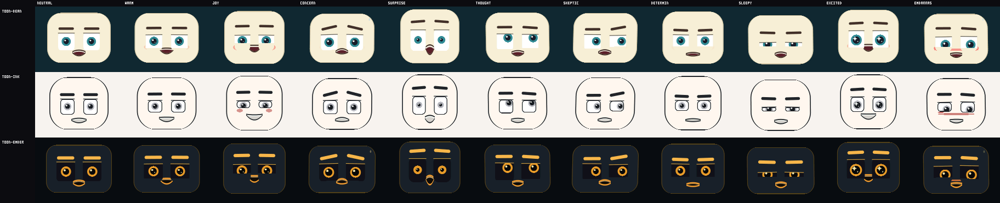

# fable_toon_acting — toon acting rig for the 40-byte renderer IR

Three production renderer styles that make the 160×120 RGB565 StackChan
face **act**: all eleven stage expressions clearly separable at
contact-sheet scale, viseme speech with coarticulation, speech
start/end anticipation and settle, gaze, head/body gestures, and
area-conserving squash & stretch — from cheap integer scanline
primitives, no heap, no floats, no state.

This is the first contribution built natively against the dense
`face_render_key_t` (schema v2) instead of the legacy 12-byte keyframe.
It consumes `stage_expression`/`expression_weight` (the axis every
earlier pack ignored — the audited reason "the 11 stage-direction rows
do not visibly differ"), honours `speech_phase`, blends
`viseme_secondary`/`viseme_blend`, and separates authored emotion from
conversational activity exactly as `face_keyframe.h` specifies.



## Styles

| # | slug | look |
|---|------|------|
| 0 | `toon-bean` | warm cream plate, big teal-iris eyes, rubber-hose mouth — the flagship |
| 1 | `toon-ink` | line art on paper, single accent colour |
| 2 | `toon-ember` | emissive amber irises on dark glass, night-friendly |

One acting solver drives all three; styles differ only in proportions,
palette, and stroke treatment, so acting quality is uniform.

## What is here

```
src/fta.h              public API (profiles, info, solve, render)
src/fta_internal.h     fixed-point conventions, style/accent contracts
src/fta_math.c         hash, smoothed waves, acting response curve
src/fta_act.c          the acting solver (life/emotion/speech/pose)
src/fta_draw.c         integer scanline compositor (AA spans, Q4 edges)
src/fta_styles.c       style registry + public entry points
compat/                verbatim firmware ABI copies for standalone builds
tests/test_fta.c       1,482-check suite incl. firmware-quality mirror
tests/golden_hashes.inc frozen FNV-1a32 frame hashes (96 cases)
bench/bench_fta.c      -O3 timing
tools/fta_dump.c       hash/sheet/cell/frame dumper (labeled sheets)
tools/make_previews.sh GIF previews (ffmpeg)
preview/               labeled contact sheets (PPM+PNG) and GIFs
DESIGN.md              architecture notes
RESEARCH.md            sources, numbers used, licensing audit
INTEGRATION.md         exact production wiring steps
manifest.json          machine-readable summary
```

## Quick start

```sh
make test          # strict native suite (1,482 checks)
make asan          # same suite under ASan+UBSan, no recover
make strict        # O0 vs O2 frame hashes byte-identical
make bench         # us/frame per profile at -O3
make sheets        # labeled contact sheets into preview/
make previews      # animated GIFs (needs ffmpeg)
make wasm-verify   # emcc build; hash tables must match native
make xtensa-check  # ESP32-S3 cross compile + float-symbol scan
```

ABI headers default to `compat/`; `ABI_INC=../../../../firmware-ws/main
make test` builds against the live tree.

## The acting model

Layered, robot-eyes style (behavior → authored emotion → dense actions
→ clamp → draw):

1. **Deterministic life** — blinks with human kinematics (94 ms close,
   50 ms hold, 244 ms fast-out reopen ≈ the measured 1:2.6 asymmetry,
   ~18/min, 15% double-blinks, pre-blink anticipation dip, blink-squash
   on the eye box), ballistic saccades with fixation drift (no
   overshoot — an overshooting gaze reads as a tic), asymmetric
   breathing (inhale 40% / exhale 60% of the cycle, rate from arousal,
   held during surprise). All schedules are hashes of the sample clock:
   any frame, any order, bit-identical.
2. **Generic action channels** — corners, cheek, per-eye squints,
   brow inner/outer, head roll/yaw/pitch, body lean, valence/arousal,
   attention, per-eye open (winks).
3. **Eleven-way accent table** — small hand-authored integer offsets
   per emotion (per the visual-review direction), adding what generic
   channels cannot separate: pupil dilation (surprise −44, excited
   +16), gaze aversion (thoughtful up-left, embarrassed down-side,
   skeptical side-eye), blush pads + cheek band, sparkle glints that
   grow into four-ray stars, posture stretch, breath/bounce character,
   and a surprise O-mouth override. Embarrassment plays a deterministic
   5 s Keltner display (gaze drop → smile control beats → smile
   re-emerges).
4. **Acting response curve** — `expression_weight` maps through a
   non-monotonic LUT (dip → rise → ~8% overshoot → settle), so a stage
   cue's attack ramp produces anticipation and settle in time with zero
   renderer state.
5. **Speech** — JALI-style split (jaw carries 60% of the opening,
   lips shape it), viseme accents for the OVR15 set blended by
   `viseme_blend`, STARTING pose (brows/lids up, lips press before the
   jaw opens), ENDING settle, audio-driven head bob and brow emphasis.
6. **Pose transform** — yaw/pitch/lean translate with 2.5D parallax
   (plate trails features), roll shears per scanline, squash & stretch
   conserves area exactly (`scale_x = 1/scale_y`) and pivots at the
   plate bottom.
7. **Hard clamps** — pupils cannot escape the lids (iris may tuck 25%
   under an edge, never leave), expression squints cannot erase an eye
   (bilateral aperture floor; only the animator or a blink may close
   one), every feature stays on the plate, the sheared plate stays in
   the safe area. Proven by test, not by hope.

## Results (2026-07-29, Apple clang 17 arm64 host)

**Correctness / determinism**

- `make test`: **1,482 checks, 0 failures** (ABI, purity, guard bands,
  full coverage, no-clip sweeps, blink behavior, pupil clamps,
  aperture floor, quality mirror, visemes, coarticulation continuity,
  phases, robustness, area conservation, 96 golden hashes).
- `make asan` (ASan + UBSan, `-fno-sanitize-recover=all`): same suite,
  **0 failures, no reports**.
- `make strict`: O0 and O2 frame hashes **byte-identical**.
- `make wasm-verify` (emscripten -O2, node): all 96 hashes **identical
  to native**; full suite passes in wasm.
- `make xtensa-check` (xtensa-esp32s3-elf-gcc 14.2.0): compiles clean
  with `-Wall -Wextra -Werror`; **no float helper symbols**.

**Acting quality** (mirror of `firmware-ws/tests/face_render_quality.c`
— same base key, same cues via the real `face_stage_cue_apply`, same
ROI and thresholds; gate: distinct ≥ 9, clear ≥ 8, mean pair ≥ 0.010,
zero jumps, max < 0.14, frozen < 30):

| profile | distinct | clear | weak pairs | mean pair ROI Δ | jumps | max Δ | frozen |
|---|---|---|---|---|---|---|---|
| toon-bean | **11/11** | **10/10** | 0/55 | 0.0999 | 0 | 0.0349 | 0 |
| toon-ink | **11/11** | **10/10** | 0/55 | 0.1065 | 0 | 0.0506 | 0 |
| toon-ember | **11/11** | **10/10** | 0/55 | 0.0623 | 0 | 0.0256 | 0 |

Mean pair separation is 6–10× the 0.010 gate; motion peaks sit 3–5×
under the 0.14 ceiling. For reference, the four newest production
profiles (pixel-pack) scored expr 45–89 with up to 25/55 weak pairs and
up to 14 jumps.

**Speed** (`make bench`, -O3, 600 frames; two runs, host variance noted)

| profile | us/frame (host) | host fps |
|---|---|---|
| toon-bean | 13.9–18.0 | ~55,000–72,000 |
| toon-ink | 15.1–18.1 | ~55,000–66,000 |
| toon-ember | 15.3–19.6 | ~51,000–65,000 |

Solver alone: 0.14 us/frame. Using the pack convention's deliberately
pessimistic 100× host→ESP32-S3 derating, the worst observed style lands
at ~2.0 ms against the 33.3 ms 30 fps budget (~17× headroom); the
`estimated_ops_per_pixel` metadata (9–11) stays conservative. Measure
under `esp_timer` before shipping device fps claims.

**Code size** (xtensa -O2): `text 15,547 B, data 0, bss 0` across the
four objects. No context struct (`FTA_CONTEXT_BYTES == 0`), stack-only
scratch, caller-owned framebuffer (38,400 B).

## Provenance

All code in this directory was written for this contribution. Behavior
targets come from published research and open documentation —
Bentivoglio 1997 blink rates, VanderWerf 2003 lid kinematics, saccade
main-sequence literature, Cohen–Massaro coarticulation, JALI's jaw/lip
split, FACS AU prototypes, Keltner 1995 embarrassment display, baby-
schema proportion studies, Cozmo/Vector *technique* notes (no assets),
M5Stack Avatar (MIT) cadence values. GPL projects (FluxGarage RoboEyes
and kin) informed **ideas only**; no code, structure, or art was taken
from them. Details and per-source licensing: `RESEARCH.md`.

## Known limits / future work

- The runtime never emits `speech_phase` STARTING/ENDING or
  coarticulation bytes yet; the pack supports both and degrades
  gracefully without them.
- Gesture kinematics are bounded by the stage layer's triangle wave;
  per-cycle amplitude decay and pre-utterance anticipation (the
  measured nod shape) would need a stage-side change.
- Accent gains are tuned for the three shipped proportion sets; a new
  style with much smaller eyes should re-tune `accent_gain_q8`.
- `fta_dump cell` renders single expression cells for review;
  a device-side `esp_timer` benchmark has not been run.

## Integration

See `INTEGRATION.md` for the exact seven touchpoints (face_render.h
enum + family, face_render.c rows/dispatch/include, CMakeLists,
build-wasm.sh, run_face_render_quality.py, test_face_rig.py, verify
command), including the dispatch snippet and expected quality numbers.
